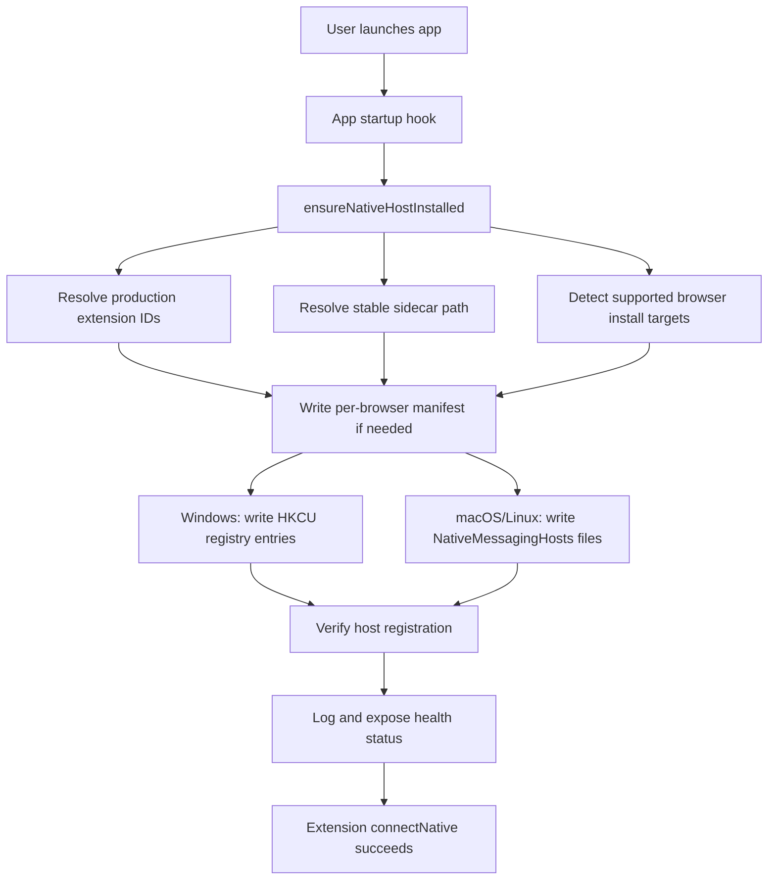

# Native Host Self-Installation Plan

## Companion Docs
Use these together with this main plan so implementation can be handed off with minimal rediscovery:
- [Native Host Code Map](native_host_auto-install_code-map.md)
- [Platform Recipes](native_host_auto-install_platform-recipes.md)
- [Implementation Blueprint](native_host_auto-install_execution-blueprint.md)
- [Release and Verification Checklist](native_host_auto-install_release-checklist.md)

Suggested handoff order:
1. Read this main plan once end-to-end.
2. Use the code map to locate current behavior and entry points.
3. Use the platform recipes while implementing OS-specific setup.
4. Use the execution blueprint as the concrete build order.
5. Use the release checklist for final validation and docs updates.

## Goal
Make the production experience:
1. Install the desktop app.
2. Install the browser extension.
3. Open the app.
4. The bridge works without any manual manifest editing, registry work, or shell scripts.

This requires moving native-host installation responsibility out of manual scripts like [packages/sidecar/manifests/install-windows.ps1](packages/sidecar/manifests/install-windows.ps1), [packages/sidecar/manifests/install-mac.sh](packages/sidecar/manifests/install-mac.sh), and [packages/sidecar/install.sh](packages/sidecar/install.sh), and into the desktop app startup path in [packages/app-tauri/src-tauri/src/lib.rs](packages/app-tauri/src-tauri/src/lib.rs).

## Recommendation
Recommend the primary production path as:
- Publish extensions so each browser gets a stable production ID.
- Let the app install and maintain the native host on every launch via an idempotent startup check.
- Keep the existing scripts only for development and emergency/manual recovery.

Also plan a secondary path for private deployments:
- Support a fixed extension key / stable private ID strategy.
- Feed those IDs into the same manifest generation pipeline.

Published IDs are the better default because they align with the “install app + extension only” goal and remove unpacked-extension ID churn.

## Current Starting Points
The implementation can reuse these repo entry points:
- App startup: [packages/app-tauri/src-tauri/src/lib.rs](packages/app-tauri/src-tauri/src/lib.rs)
- Sidecar package/build docs: [packages/sidecar/README.md](packages/sidecar/README.md)
- Native-host internals: [packages/sidecar/docs/native-host.md](packages/sidecar/docs/native-host.md)
- Windows native-host registration logic: [packages/sidecar/manifests/install-windows.ps1](packages/sidecar/manifests/install-windows.ps1)
- macOS registration logic: [packages/sidecar/manifests/install-mac.sh](packages/sidecar/manifests/install-mac.sh)
- Unix cross-platform registration logic: [packages/sidecar/install.sh](packages/sidecar/install.sh)
- Extension native-host client entry: [packages/ext-plasmo/src/background.ts](packages/ext-plasmo/src/background.ts)
- Repo/release docs to update: [README.md](README.md), [docs/windows-dev-setup.md](docs/windows-dev-setup.md), [packages/app-tauri/README.md](packages/app-tauri/README.md), [packages/sidecar/manifests/README.md](packages/sidecar/manifests/README.md)

Important current behavior to preserve:
- The extension always connects through `chrome.runtime.connectNative("com.bridge.app")` in [packages/ext-plasmo/src/background.ts](packages/ext-plasmo/src/background.ts).
- The browser host manifest still needs a correct `allowed_origins` list and a stable sidecar `path`.
- On Windows, registry registration is required; on macOS/Linux, file placement is required.

For concrete snippets and extracted current-state references, see [Native Host Code Map](native_host_auto-install_code-map.md).

## Target Architecture

## Phase 1: Decide and Centralize Extension ID Strategy
Create a single source of truth for production extension IDs instead of scattering them through JSON/scripts.

### Deliverables
- A Rust-side config model for browser-to-extension-ID mapping.
- A build-time or runtime source for:
  - Chrome production ID
  - Edge production ID
  - Brave production ID
  - Comet production ID if supported
  - Firefox ID only if Firefox remains in scope and the native host path is validated separately
- A fallback/private deployment config path for fixed-key builds.

### Implementation notes
- Do not keep editing [packages/sidecar/manifests/com.bridge.app.json](packages/sidecar/manifests/com.bridge.app.json) by hand for production.
- Treat the current scripts as reference implementations only.
- Introduce a clear separation between:
  - development IDs / unpacked builds
  - production IDs / store builds
  - private enterprise IDs / fixed-key builds

### Recommended approach
- Primary: store-published stable IDs
- Secondary: private fixed-key IDs
- Explicitly do not optimize the app for “unknown unpacked extension IDs” in production.

## Phase 2: Add a Native Host Manager to the Tauri App
Create a new Rust module in the Tauri backend responsible for native-host installation and verification, for example under [packages/app-tauri/src-tauri/src](packages/app-tauri/src-tauri/src).

### Responsibilities
- Resolve the final sidecar executable path.
- Build correct manifest JSON content.
- Detect browser targets available on the machine.
- Install/update manifests.
- On Windows, install/update HKCU registry entries.
- Verify the expected state after writing.
- Return a structured status object for logging/UI/debugging.

### Suggested module shape
- `native_host/mod.rs`
- `native_host/config.rs`
- `native_host/paths.rs`
- `native_host/install.rs`
- `native_host/verify.rs`
- `native_host/platform_windows.rs`
- `native_host/platform_macos.rs`
- `native_host/platform_linux.rs`

### Suggested API
- `ensure_native_host_installed() -> Result<NativeHostStatus>`
- `verify_native_host() -> NativeHostStatus`
- `render_manifest(browser_target, sidecar_path, extension_ids) -> String`

For a more concrete module skeleton and pseudocode, see [Implementation Blueprint](native_host_auto-install_execution-blueprint.md).

## Phase 3: Resolve a Stable Sidecar Path Per Platform
The manifest `path` must reference a stable installed sidecar path, not a dev build path and not an update-volatile location.

### Windows
- Prefer the installed app directory or a bundled sidecar path under the app install location.
- Ensure the path survives app updates or is refreshed on every launch.

### macOS
- Resolve the sidecar path inside the installed app bundle or an app-managed support directory.
- Avoid using temporary/translocated locations from an unsigned or first-run DMG launch.
- Verify the app is using the installed path before writing manifests.

### Linux
- Avoid pointing manifests at transient AppImage mount paths.
- Prefer either:
  - a packaged install path from `.deb`/`.rpm`, or
  - a stable user-writable app data/bin location that the app maintains itself.

### Migration behavior
If the sidecar path changes after an update, the app should rewrite manifests automatically on next launch.

## Phase 4: Implement Platform-Specific Native Host Installation

### Windows
Recreate in Rust what [packages/sidecar/manifests/install-windows.ps1](packages/sidecar/manifests/install-windows.ps1) does today.

#### Tasks
- Generate `com.bridge.app.json` content with the final sidecar path.
- Write the manifest to an app-controlled location.
- Register `HKCU\Software\...\NativeMessagingHosts\com.bridge.app` for each supported browser.
- Support all current browser targets in repo scope, including Chromium variants already documented in [docs/windows-dev-setup.md](docs/windows-dev-setup.md).
- Keep everything in `HKCU` so admin rights are not required.

#### Verification
- Registry value points to the intended manifest file.
- Manifest file exists.
- Manifest JSON contains the correct `name`, `path`, `type`, and `allowed_origins`.

### macOS
Recreate in Rust what [packages/sidecar/manifests/install-mac.sh](packages/sidecar/manifests/install-mac.sh) does today.

#### Tasks
- Write per-browser manifests into user-level `NativeMessagingHosts` directories under `~/Library/Application Support/...`.
- Create directories if missing.
- Support Chrome, Edge, Brave, Chromium, and any additional browser paths you decide to officially support.

#### Verification
- Expected `NativeMessagingHosts/com.bridge.app.json` exists for each detected target.
- Manifest contents match the current desired content.

### Linux
Recreate in Rust what [packages/sidecar/install.sh](packages/sidecar/install.sh) does today for Linux.

For browser locations, manifest shape, and what must be preserved from the existing scripts, see [Platform Recipes](native_host_auto-install_platform-recipes.md).

#### Tasks
- Write manifests into `~/.config/.../NativeMessagingHosts` for supported browsers.
- Create directories if missing.
- Confirm whether Firefox native-host support is still a release goal; if yes, add the equivalent Firefox-specific host placement and schema handling instead of leaving it implied.

#### Verification
- Same as macOS: file exists, content matches, sidecar path is executable and stable.

## Phase 5: Make Installation Idempotent and Self-Healing
Do not run this only on “first launch.” Run a lightweight verification on every startup and repair when necessary.

### Rules
- Compute desired manifest content from the current app version, sidecar path, and extension IDs.
- Compare existing manifest contents before rewriting.
- Skip writes when already correct.
- Repair missing or stale files automatically.
- On Windows, repair missing registry entries automatically.
- Log what changed and what was already healthy.

### Why this matters
This handles:
- app updates that move files
- users installing a new supported browser later
- deleted manifest files
- broken registry state
- migration from older dev builds

## Phase 6: Define Browser Target Detection and Support Policy
Since the plan targets all browsers currently touched by the repo, explicitly define which are:
- fully supported in production
- best-effort supported
- dev-only today

### Suggested categories
- Tier 1: Chrome, Edge, Brave, Comet if actively tested
- Tier 2: Chromium if path-compatible and tested lightly
- Tier 3: Firefox only if native-host manifest placement, extension packaging, and protocol parity are confirmed

### Detection strategy
- If the browser-specific config root exists, install the manifest there.
- Optionally add a conservative “always create known directories” mode behind config, but default to detected installs only.

## Phase 7: Wire the App Startup Flow
Integrate the native-host manager into [packages/app-tauri/src-tauri/src/lib.rs](packages/app-tauri/src-tauri/src/lib.rs) during app setup.

### Startup sequence
1. App boots.
2. Native-host manager runs before or alongside bridge initialization.
3. Status is logged via `tracing`.
4. Bridge WebSocket startup continues.
5. Optional: app emits status to the frontend for diagnostics.

### Suggested behavior
- Startup should not fail hard if one browser target cannot be configured.
- Instead, return a multi-target status with warnings.
- Fail hard only if the sidecar path itself cannot be resolved at all.

## Phase 8: Add Diagnostics and User-Facing Recovery Hooks
Focus on observability so production support is manageable.

### Tauri-side diagnostics
- Structured logs for each browser target:
  - detected/not detected
  - manifest written/skipped/repaired
  - registry written/skipped/repaired
  - verification passed/failed
- Redact only what is sensitive; paths are useful for troubleshooting.

### Optional frontend support
- Add a diagnostics section in the desktop UI showing:
  - native host setup status per browser
  - detected extension ID map
  - sidecar path in use
  - last verification result
- Add a “Repair browser integration” action later if needed, but keep it out of initial scope if you want to minimize UI work.

## Phase 9: Packaging and Release Integration
The app build must bundle or install the sidecar in a known location and provide the native-host manager enough information to reference it.

### Build/release work
- Update release steps in [README.md](README.md), [packages/app-tauri/README.md](packages/app-tauri/README.md), and [docs/windows-dev-setup.md](docs/windows-dev-setup.md).
- Ensure `tauri build` output includes the sidecar or a mechanism to deploy it beside the installed app.
- Remove the assumption in docs that users or developers copy production manifests manually.

### Per-platform packaging goals
- Windows installer: install app + bundled sidecar; app startup repairs registry/manifests.
- macOS app bundle or installer: install app + bundled sidecar; app startup writes per-user manifests.
- Linux package/app bundle: install app + stable sidecar; app startup writes per-user manifests.

## Phase 10: Migration From Current Dev/Manual Scripts
Preserve the current scripts for developers, but clearly downgrade them from “how production works” to “manual/dev fallback tools.”

### Migration tasks
- Keep [packages/sidecar/manifests/install-windows.ps1](packages/sidecar/manifests/install-windows.ps1), [packages/sidecar/manifests/install-mac.sh](packages/sidecar/manifests/install-mac.sh), and [packages/sidecar/install.sh](packages/sidecar/install.sh) for dev and recovery.
- Update docs to explain:
  - dev workflow: manual or scripted install remains available
  - production workflow: app self-installs native host automatically
- Add versioned migration logic if older paths or manifest locations need cleanup.

## Phase 11: Testing Strategy
This change touches packaging and OS integration, so verification must go beyond unit tests.

### Unit tests
Add focused tests for:
- manifest rendering
- browser path resolution helpers
- “needs rewrite?” logic
- extension-ID config loading

### Integration tests
Where practical, test:
- startup on a clean profile/home directory fixture
- manifest generation for each platform target
- Windows registry write abstraction behind a testable layer

### Manual verification matrix
Run on clean machines or VMs for:
- Windows + Chrome/Edge/Brave/Comet
- macOS + Chrome/Edge/Brave/Chromium
- Linux + Chrome/Chromium/Edge/Brave
- Firefox only if kept in release scope

For each cell verify:
1. App first launch installs/repairs host integration.
2. Extension connects without manual steps.
3. `tabs.list` works.
4. `tabs.openOrFocus` works.
5. App relaunch does not break or duplicate setup.
6. App update with moved sidecar path repairs manifests.

Use [Release and Verification Checklist](native_host_auto-install_release-checklist.md) as the final execution checklist.

## Phase 12: Security and Trust Boundaries
Since the app writes browser integration files, keep the design conservative.

### Guardrails
- Only write known manifest locations for supported browsers.
- Only register `com.bridge.app`.
- Only reference the bundled/stable sidecar path.
- Avoid shelling out to platform scripts from production app code when native Rust APIs/file I/O are sufficient.
- On Windows, write `HKCU` only, not machine-wide registry.

## Phase 13: Documentation Deliverables
Update these docs to reflect the new production story:
- [README.md](README.md)
- [packages/app-tauri/README.md](packages/app-tauri/README.md)
- [packages/sidecar/README.md](packages/sidecar/README.md)
- [packages/sidecar/manifests/README.md](packages/sidecar/manifests/README.md)
- [docs/windows-dev-setup.md](docs/windows-dev-setup.md)
- Add a new cross-platform release doc under [docs](docs)

### Documentation goals
- Separate development setup from production setup.
- State clearly that real users should never edit `com.bridge.app.json` manually.
- Explain that the app repairs native-host setup automatically.
- Document browser support tiers and extension ID expectations.

## Recommended Implementation Order
1. Centralize production extension-ID config.
2. Implement manifest rendering and verification helpers.
3. Add stable sidecar path resolution.
4. Implement Windows installer/checker in Rust.
5. Implement macOS and Linux manifest installer/checker in Rust.
6. Wire startup execution in Tauri.
7. Add diagnostics/logging.
8. Update packaging.
9. Update docs.
10. Run clean-machine validation.

## Open Design Decisions To Resolve During Implementation
These should be settled early, but they do not block starting the architecture work:
- Which current browsers become officially supported in production Tier 1.
- Whether Firefox remains in release scope.
- Whether Linux should support AppImage directly or require a more stable installed path.
- Whether to expose a user-facing “Repair integration” button in v1 or keep repair fully automatic.

## Success Criteria
The work is complete when:
- A user can install the desktop app and the production extension, open the app, and use the bridge with no manual manifest steps.
- The app repairs broken native-host registration automatically on subsequent launches.
- Windows, macOS, and Linux each use the correct native-host registration mechanism.
- Extension IDs are stable and production-safe.
- The current dev scripts remain available but are no longer part of the real-user flow.
