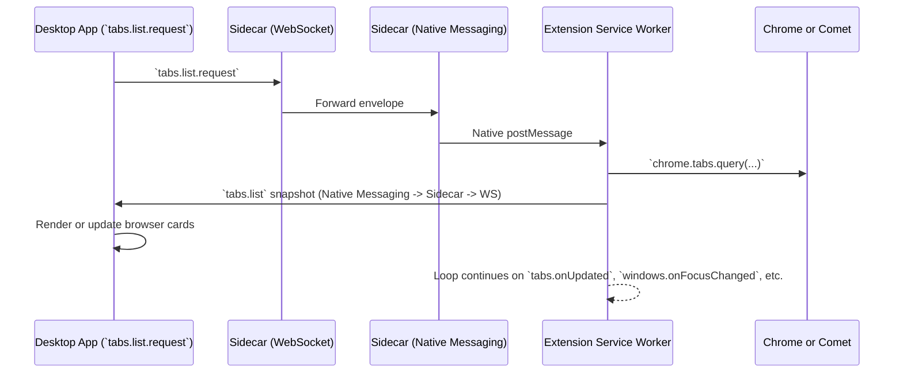
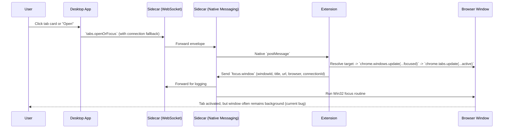

# Bridge Workspace Architecture

The bridge workspace keeps three runtimes in sync so the desktop app can observe and control browser tabs:

| Component | Location | Primary Role | Key Transports |
| --- | --- | --- | --- |
| Desktop app | `packages/app-tauri` (React + Tauri) | Renders live browser state, issues `tabs.openOrFocus` and `tabs.restore` commands | WebSocket to the sidecar |
| Native sidecar | `packages/sidecar` (Rust) | Bridges WebSocket <-> Chrome native messaging, invokes Win32 focus APIs | TCP WebSocket, stdio native messaging, Win32 |
| Browser extension | `packages/ext-plasmo` (MV3 service worker) | Streams tab snapshots, resolves targets, sends `focus.window` hints | Chrome extension APIs, native messaging |

Shared TypeScript schemas in `packages/shared-proto` keep every envelope compatible between the three environments.

## Live Tab Snapshot Loop

The extension pushes a `tabs.list` payload whenever Chromium signals tab or window activity, or when the desktop app explicitly asks for a refresh:

The desktop app caches snapshots by `connectionId`. A connection represents one running native host plus service worker; when that connection goes offline, its presence message prompts the UI to drop the snapshot.

## Focus Request Flow (`tabs.openOrFocus`)

When the user clicks a tab in the desktop UI, the bridge attempts to focus the browser window and activate the tab:

The new `focus.window` message powers the Win32 foreground routine in `packages/sidecar/src/focus.rs`. Logs confirm the routine runs, yet Windows 10/11 still prevent true foreground activation.

## Why Foregrounding Still Fails

The sidecar currently performs these steps:

1. Call `AllowSetForegroundWindow` for `ASFW_ANY` and the browser PID.
2. Restore minimized windows with `ShowWindow(SW_RESTORE)`.
3. Toggle topmost state with `SetWindowPos` (TOPMOST then NOTOPMOST).
4. Finish with `BringWindowToTop` and `SetForegroundWindow`.

HWNDs are cached by `windowId` and recomputed via `EnumWindows` if necessary. Despite this, Windows focus-stealing heuristics still block the final foreground call when another application owns focus. Additional synchronization (thread attachment, simulated input, better window targeting, retries) is likely required.

## Message Catalogue

| Message | Origin -> Target | Purpose | Notes |
| --- | --- | --- | --- |
| `presence.status` | Sidecar -> App | Track connected browsers (`connectionId`, `browser`) | App removes snapshots when the sidecar reports `sidecar: offline` |
| `tabs.list` | Extension -> App | Stream tab and window snapshots | Includes inferred browser name and `connectionId` |
| `tabs.openOrFocus` | App -> Extension | Activate or create a tab | App minimizes itself before sending to reduce flicker |
| `focus.window` | Extension -> Sidecar | Ask Windows to foreground the browser window | Implemented on Windows only; still blocked by OS |
| `tabs.restore` | App -> Extension | Re-open saved tab collections (suspend or eager) | Extension uses current snapshots to choose a target window |

## Related Documentation

- Developer setup: [docs/dev-setup.md](windows-dev-setup.md)
- Focus debugging timeline: [docs/troubleshooting/window-focus.md](./troubleshooting/window-focus.md)
- Extension details: [`../packages/ext-plasmo/docs/extension.md`](../packages/ext-plasmo/docs/extension.md)
- Native host internals: [`../packages/sidecar/docs/native-host.md`](../packages/sidecar/docs/native-host.md)
