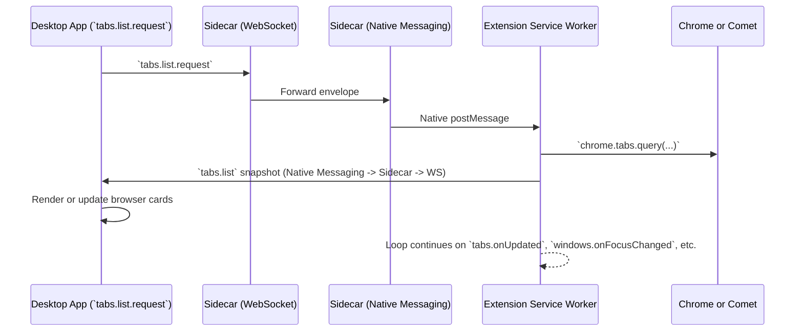

# Bridge Workspace Architecture

The bridge workspace keeps three runtimes in sync so the desktop app can observe and control browser tabs:

| Component | Location | Primary Role | Key Transports |
| --- | --- | --- | --- |
| Desktop app | `packages/app-tauri` (React + Tauri) | Renders live browser state, issues `tabs.openOrFocus` and `tabs.restore` commands | WebSocket to the sidecar |
| Native sidecar | `packages/sidecar` (Rust) | Bridges WebSocket <-> Chrome native messaging, invokes Win32 focus APIs | TCP WebSocket, stdio native messaging, Win32 |
| Browser extension | `packages/ext-plasmo` (MV3 service worker) | Streams tab snapshots, resolves targets, sends `focus.window` hints | Chrome extension APIs, native messaging |

Shared TypeScript schemas in `packages/shared-proto` keep every envelope compatible between the three environments.

## Live Tab Snapshot Loop

The extension pushes a `tabs.list` payload whenever Chromium signals tab or window activity, or when the desktop app explicitly asks for a refresh:

```mermaid
sequenceDiagram
    participant App as Desktop App (`tabs.list.request`)
    participant WS as Sidecar (WebSocket)
    participant NM as Sidecar (Native Messaging)
    participant Ext as Extension Service Worker
    participant Chrome as Chrome or Comet

    App->>WS: `tabs.list.request`
    WS->>NM: Forward envelope
    NM->>Ext: Native postMessage
    Ext->>Chrome: `chrome.tabs.query(...)`
    Ext->>App: `tabs.list` snapshot (Native Messaging -> Sidecar -> WS)
    App->>App: Render or update browser cards
    Ext-->>Ext: Loop continues on `tabs.onUpdated`, `windows.onFocusChanged`, etc.
```

The desktop app caches snapshots by `connectionId`. A connection represents one running native host plus service worker; when that connection goes offline, its presence message prompts the UI to drop the snapshot.

## Focus Request Flow (`tabs.openOrFocus`)

When the user clicks a tab in the desktop UI, the bridge attempts to focus the browser window and activate the tab:

```mermaid
sequenceDiagram
    participant User
    participant App as Desktop App
    participant WS as Sidecar (WebSocket)
    participant NM as Sidecar (Native Messaging)
    participant Ext as Extension
    participant Browser as Browser Window

    User->>App: Click tab card or "Open"
    App->>App: Windows: `AllowSetForegroundWindow(ASFW_ANY)` (input token from UI)
    App->>WS: `tabs.openOrFocus` (with connection fallback)
    WS->>NM: Forward envelope
    NM->>Ext: Native `postMessage`
    Ext->>Browser: Resolve target -> `chrome.windows.update(...focused)` -> `chrome.tabs.update(...active)`
    Ext->>NM: `focus.window` with cached `hwnd`
    Note over NM: Consumed on native stdin; not forwarded over WebSocket
    NM->>Browser: Win32 focus (`GetAncestor` root, retries, `SetForegroundWindow`)
    Browser-->>User: Tab activated; window should come forward when OS allows it
```

Details: [docs/troubleshooting/window-focus.md](./troubleshooting/window-focus.md).

## Foreground handling (Windows)

The **desktop app** calls `AllowSetForegroundWindow` when sending `tabs.openOrFocus` / `tabs.restore` so a user-driven action can unlock the next foreground change. The **sidecar** resolves the **root** HWND, uses **`AttachThreadInput`**, restore/topmost/`BringWindowToTop`/`SetForegroundWindow`, logs failures, and **retries** if `GetForegroundWindow` does not match. HWNDs come from **`windows.list`** (process tree + Chromium class filter) and are cached in the **extension** by `windowId`. OS policy, elevation mismatch, or security software can still block activation on some machines.

## Message Catalogue

| Message | Origin -> Target | Purpose | Notes |
| --- | --- | --- | --- |
| `presence.status` | Sidecar -> App | Track connected browsers (`connectionId`, `browser`) | App removes snapshots when the sidecar reports `sidecar: offline` |
| `tabs.list` | Extension -> App | Stream tab and window snapshots | Includes inferred browser name and `connectionId` |
| `tabs.openOrFocus` | App -> Extension | Activate or create a tab | App minimizes itself before sending to reduce flicker |
| `focus.window` | Extension -> Sidecar (native messaging only) | Foreground browser via Win32 using cached `hwnd` | Windows: root HWND, retries, logging; may still fail under strict OS rules |
| `tabs.restore` | App -> Extension | Re-open saved tab collections (suspend or eager) | Extension uses current snapshots to choose a target window |

## Related Documentation

- Developer setup: [docs/dev-setup.md](windows-dev-setup.md)
- Focus debugging timeline: [docs/troubleshooting/window-focus.md](./troubleshooting/window-focus.md)
- Extension details: [`../packages/ext-plasmo/docs/extension.md`](../packages/ext-plasmo/docs/extension.md)
- Native host internals: [`../packages/sidecar/docs/native-host.md`](../packages/sidecar/docs/native-host.md)
